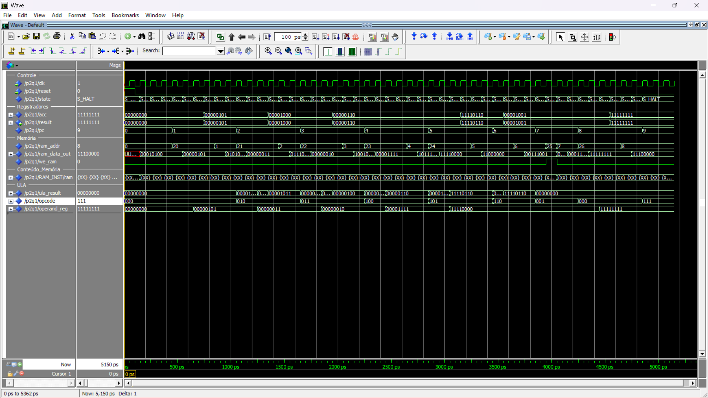
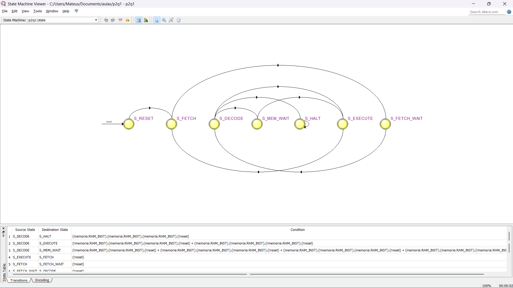

[Read this in English](README.md)

---

# Microprocessador de 8 bits (VHDL)

 

## 📖 Sobre o Projeto

Este repositório contém a implementação de um microprocessador simples de 8 bits, desenvolvido como projeto final da disciplina de Circuitos Digitais II na Universidade Federal de Mato Grosso do Sul (UFMS), projetado utilizando VHDL-2008.

O objetivo do projeto foi projetar, implementar e simular um sistema computacional mínimo, compreendendo uma Unidade Lógica e Aritmética (ULA), uma Unidade de Memória e uma Unidade de Controle (FSM), capaz de executar um conjunto básico de instruções.

## ✨ Funcionalidades

O microprocessador implementado possui as seguintes características:

- **Arquitetura:** Baseada em Acumulador (Von Neumann).
- **Memória RAM:** Uma memória de 64x8-bits (ADDR_WIDTH = 6, DATA_WIDTH = 8).
- **Conjunto de Instruções:** Subconjunto tipo CISC (Aritmética, Lógica, Acesso à Memória e Fluxo de Controle).
- **Memória:** RAM Síncrona de Porta Única (64 Bytes).
- **Temporização:** Execução em ciclo único para operações da ULA, multiciclo para operações de memória.
- **Controle de Fluxo**: Inclui uma instrução HALT para encerrar a execução do programa.

## 🏛️ Arquitetura

O sistema é baseado numa arquitetura de acumulador simples. Os principais componentes são:
- **Unidade de Controle:** Implementada como uma Máquina de Estados Finitos (FSM) que orquestra o ciclo de busca, decodificação e execução das instruções.
- **Unidade Lógica e Aritmética (ULA):** Um bloco combinacional que realiza as operações aritméticas e lógicas.
- **Memória (RAM):** Um componente sequencial para armazenar tanto as instruções do programa quanto os dados.
- **Registradores:**
  - `acc` (Acumulador): Armazena o resultado das operações.
  - `ri` (Registrador de Instrução): Armazena a instrução atual.
  - `contador` (Contador de Programa): Aponta para o endereço da próxima instrução.

## 💻 Conjunto de Instruções (ISA)

As instruções possuem 8 bits, divididos em um opcode de 3 bits e um endereço/operando de 5 bits.

| Opcode | Mnemónico | Descrição                                        |
| :----: | :-------: | :----------------------------------------------- |
| `000`  |   `LOAD`  | Carrega um dado da memória para o acumulador.      |
| `001`  |  `STORE`  | Salva o valor do acumulador numa posição de memória. |
| `010`  |   `ADD`   | Soma o valor do acumulador com um dado da memória. |
| `011`  |   `SUB`   | Subtrai um dado da memória do valor do acumulador. |
| `100`  |   `AND`   | Realiza um `AND` lógico entre o acumulador e um dado. |
| `101`  |   `OR`    | Realiza um `OR` lógico entre o acumulador e um dado.  |
| `110`  |   `NOT`   | Inverte os bits do acumulador.                   |
| `111`  |   `HALT`  | Para a execução do processador.                  |

## 🛠️ Ferramentas Utilizadas

- **Linguagem:** VHDL (Padrão 2008)
- **Simulação:** ModelSim - Altera

## 🚀 Como Utilizar

Para simular este projeto:
1.  Clone o repositório:
    ```bash
    git clone https://github.com/Mateus-eeengineer/simple-microprocessor.git
    ```
2.  Abra o ModelSim.
3.  No console do ModelSim, navegue até o diretório do projeto.
4.  Execute o script de simulação:
    ```tcl
    do microprocessor.do
    ```
5.  A janela de ondas (Wave) será aberta e a simulação será executada, mostrando o funcionamento do processador.

## 📊 Simulação e Resultados

### Análise de Formas de Onda
A forma de onda a seguir demonstra a execução de um programa de teste (LOAD -> ADD -> STORE). Observe as transições de state e a atualização correta do registrador acc ao final de cada ciclo de instrução.

  
*"Figura 1: Execução bem-sucedida do testbench, atingindo o estado HALT com o valor esperado no acumulador."*

### Diagrama da Máquina de Estados Finitos (FSM)
A unidade de controle opera com base no seguinte diagrama de transição de estados, garantindo a temporização adequada para operações de leitura/escrita na memória.


*"Figura 2: Diagrama dos oito estados da FSM que controlam o comportamento da CPU."*
